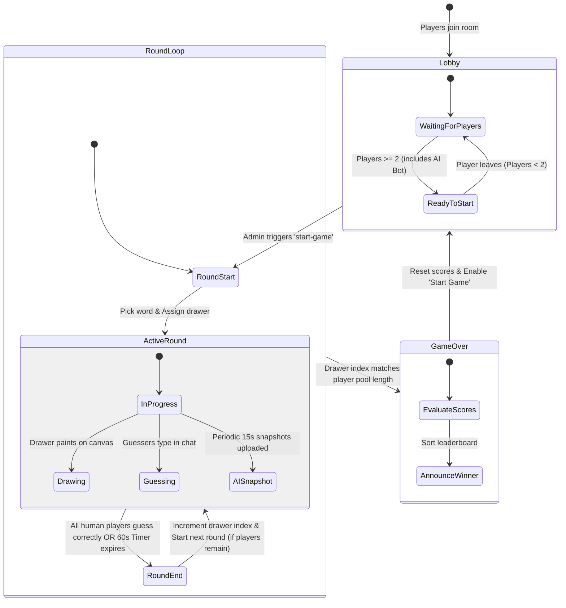
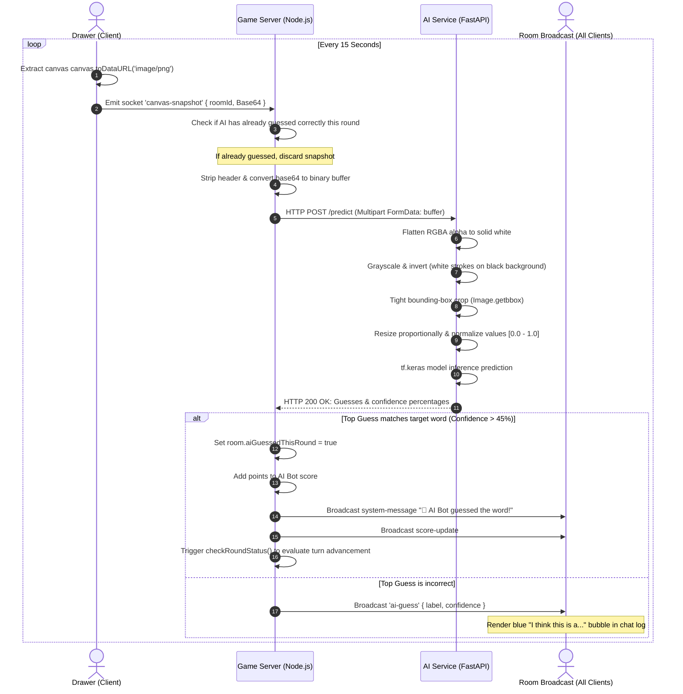
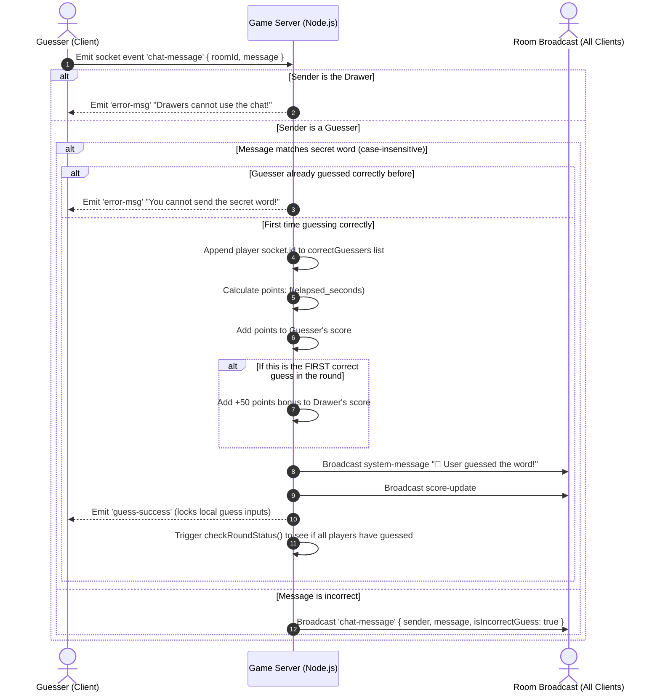

# 🔄 System Workflows & Sequences

This document provides visual representations of the core workflows in the **Scribble AI Platform**. It uses Mermaid flowcharts and sequence diagrams to detail the game lifecycle, drawing synchronization, guess verification, and the AI prediction loops.

---

## 🏁 1. Game & Round Lifecycle
The state machine of a room progresses through three main phases: Lobby Setup, Round Loop, and Game Over.



---

## 🎨 2. Real-Time Drawing Sync
Drawing coordination occurs as a stream of vector events. Coordinates are normalized on the drawer's client and restored on guesser canvases.

```mermaid
sequenceDiagram
    autonumber
    actor Drawer as Drawer (Client)
    participant Server as Game Server (Node.js)
    database Redis as Canvas Cache (Redis)
    actor Guesser as Guesser (Client)

    Note over Drawer, Guesser: Game in progress (Drawer drawing)
    
    Drawer->>Drawer: Capture mouse/touch coords
    Drawer->>Drawer: Convert coords to 800x500 normalized bounds
    Drawer->>Drawer: Draw local pixel coordinate on Canvas
    
    Drawer->>Server: Emit socket event 'draw-data' { roomId, coordinates }
    
    par Save & Broadcast
        Server->>Redis: LPUSH room:roomId:history { coordinates }
        Server->>Redis: EXPIRE room:roomId:history 7200s (2hr TTL)
    and
        Server->>Guesser: Broadcast socket event 'draw-data' { coordinates }
    end
    
    Guesser->>Guesser: Read brush parameters (color, size)
    Guesser->>Guesser: Map 800x500 coordinates back to local canvas bounds
    Guesser->>Guesser: Draw line segment
```

---

## 🤖 3. AI Prediction Pipeline
The AI loop runs automatically every 15 seconds. It handles image conversion on the server and runs inference inside the TensorFlow container.



---

## 💬 4. Guess & Scoring Evaluation
When human guessers submit chat messages, they are intercepted by the scoring engine rather than simply being relayed.


